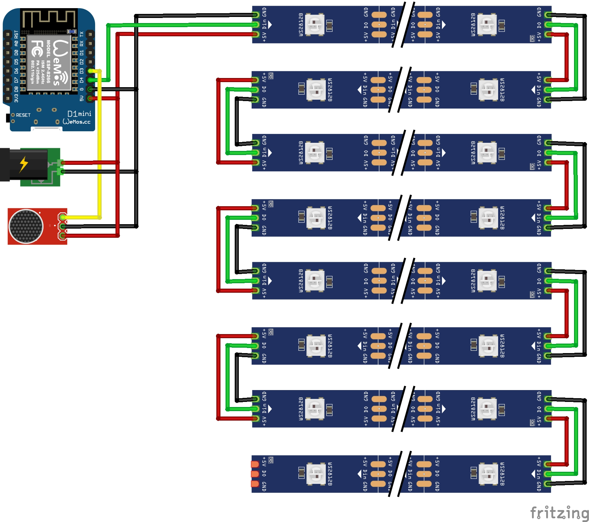

# FastLED + ESP8266 Web Server for Desk Lamp

This is a fork of [jasoncoon's esp8266 fastled webserver](https://github.com/jasoncoon/esp8266-fastled-webserver) that was adapted to control my  [WiFi Controlled Desk Lamp](https://www.thingiverse.com/thing:3676533) and the [Twisted WiFi Controlled Desk Lamp](https://www.thingiverse.com/thing:4129249).

   

Hardware
--------

**Check out the projects on [Thingiverse](https://www.thingiverse.com/Surrbradl08/things) for more details.**

Installation
--------
**FOR INSTALLATION REFER TO THE [Software_Installation.md](https://github.com/NimmLor/esp8266-fastled-desk-light/blob/master/Software_Installation.md)**

Features
--------
* Turn the Logo on and off
* **ALEXA SMART HOME DEVICE**
* **Sound Reactive Mode**
* Adjust the brightness, color and patterns
* Play over 30+ patterns in Autoplay

Web App
--------

The web app is stored in SPIFFS (on-board flash memory).

## Circuit

## Technical

Patterns are requested by the app from the ESP8266, so as new patterns are added, they're automatically listed in the app.

The web app is stored in SPIFFS (on-board flash memory).

The web app is a single page app that uses [jQuery](https://jquery.com) and [Bootstrap](http://getbootstrap.com).  It has buttons for On/Off, a slider for brightness, a pattern selector, and a color picker (using [jQuery MiniColors](http://labs.abeautifulsite.net/jquery-minicolors)).  Event handlers for the controls are wired up, so you don't have to click a 'Send' button after making changes.  The brightness slider and the color picker use a delayed event handler, to prevent from flooding the ESP8266 web server with too many requests too quickly.

The only drawback to SPIFFS that I've found so far is uploading the files can be extremely slow, requiring several minutes, sometimes regardless of how large the files are.  It can be so slow that I've been just developing the web app and debugging locally on my desktop (with a hard-coded IP for the ESP8266), before uploading to SPIFFS and testing on the ESP8266.

### Alexa

The code has an optional feature to be able to control the lamp via Alexa on any Amazon Echo device. For setup instructions refer to [Software_Installation.md](https://github.com/NimmLor/esp8266-fastled-desk-light/blob/master/Software_Installation.md) document.

### Compression

The web app files can be gzip compressed before uploading to SPIFFS by running the following command:

`gzip -r data/`

The ESP8266WebServer will automatically serve any .gz file.  The file index.htm.gz will get served as index.htm, with the content-encoding header set to gzip, so the browser knows to decompress it.  The ESP8266WebServer doesn't seem to like the Glyphicon fonts gzipped, though, so I decompress them with this command:

`gunzip -r data/fonts/`

### REST Web services

The firmware implements basic [RESTful web services](https://en.wikipedia.org/wiki/Representational_state_transfer) using the ESP8266WebServer library.  Current values are requested with HTTP GETs, and values are set with POSTs using query string parameters.  It can run in connected or standalone access point modes.
